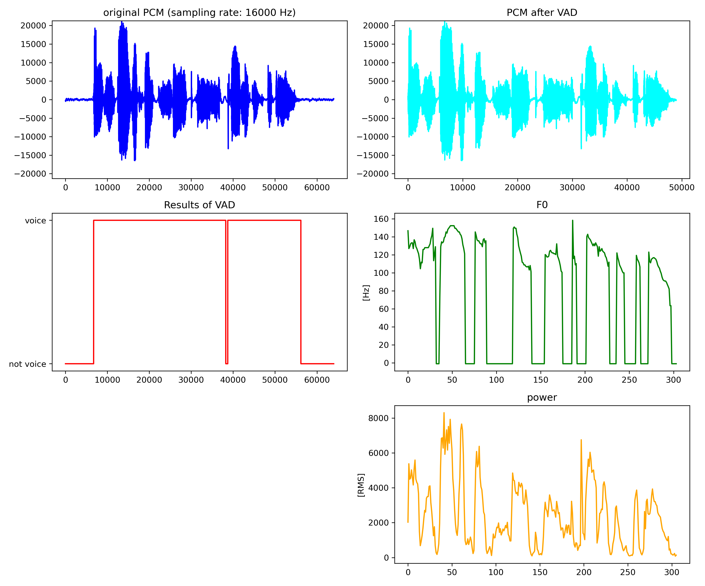

# voice_analysis

## 概要

- wavファイルを分析するためのツール
  - サンプリングレートは{8k, 16k, 32k, 48k}のみに対応
  - チャンネルはモノラル（1ch）のみに対応
- VADをかけて非音声区間を取り除いた後，パワーとピッチ（F0）を計算して，その統計量を計算する

## 環境

- Python 3系
  - numpy
  - scipy
  - matplotlib
  - tqdm
  - [py-webrtcvad](https://github.com/wiseman/py-webrtcvad)
  - [pysptk](https://github.com/r9y9/pyreaper)
  - [pyreaper](https://github.com/r9y9/pysptk)
- MSVC 140（Windowsの場合は{py-webrtcvad, pyreaper, pysptk}のbuildに必要）
  
## 使い方

- 例
  - `python VoiceAnalysis.py wav.list out --vad_mode 3 --f0_period 10 --power_period 10`

### 変数

**太字**は必須の変数

- inlist
  - 解析したいwavファイルのパスが書かれたファイル
- outd
  - 出力先のディレクトリ名
  - F0の統計量とパワーの統計量が記録されたtsvファイルをそれぞれ出力
- --vad_mode
  - VADの判定レベルを{0, 1, 2, 3}から選ぶ
  - 0が最も甘く，3が最も厳しい
  - デフォルトは**1**
  - 詳細はpy-webrtcvadのドキュメントを参照
- --vad_frame_duration
  - VADの窓幅を{10, 20, 30}msから選択する
  - デフォルトは**10**
- --f0_range
  - F0の最小値と最大値を選択する
  - デフォルトは**40.0**と**500.0**
  - 詳細はpyreaperのドキュメントを参照
- --f0_period
  - F0を計算するときの窓幅を指定（単位はms）
  - デフォルトは**5**
- --power_period
  - パワーを計算するときの窓幅を指定（単位はms）
  - デフォルトは**5**
- --power_type
  - パワーの単位を{rms, db}から指定する
  - rmsは波形の数値のRMSをとったもの，dbはそれをdBに変換したもの
  - デフォルトは**rms**
- --demo
  - 変数をつけると，引数で指定されたパラメタでデモを実行
  - デモファイルはpysptkの中のデモ音声を使う
  - $inlistは不要なので，適当に何か入れておけばよい
  - $outdにデモ結果，オリジナルとVAD後のwavファイルを書き出し
- --demo_index
  - 数値を入力すると，その数値をインデックス番号として$inlistのファイルにデモを実行
  - 例えば0なら，$inlistの0番目のwavファイルを使ってデモを実行する
  - $outdにデモ結果，オリジナルとVAD後のwavファイルを書き出し

### デモ

- 下記のような図が作成される
  - 実行コマンド: `python VoiceAnalysis.py hoge demo --vad_mode 3 --f0_period 10 --power_period 10 --demo`
- 左上：オリジナルの音声波形
- 左下：VADの結果
- 右上：VAD後の音声波形
- 右中：VAD語の音声から計算されたF0
- 右下：VAD後の音声から計算されたパワー

